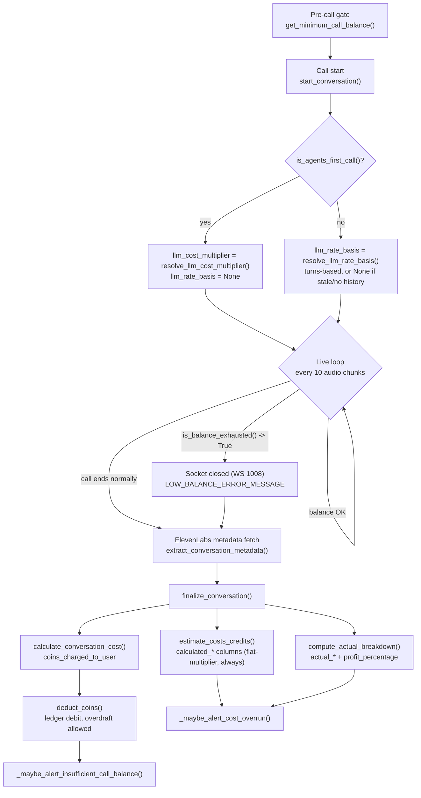

# Call Cost Calculation Pipeline

Technical reference for how a call's cost is estimated while it's running,
reconciled once it ends, and charged to the user. Covers every function, every
ElevenLabs field, and every database column involved, in the order they
actually run.

Source files: `app_v2/utils/cost_utils.py`, `app_v2/utils/conversation_lifecycle.py`,
`app_v2/utils/coin_utils.py`, `app_v2/routers/agents.py`,
`app_v2/utils/elevenlabs/conversation_utils.py`, `app_v2/utils/elevenlabs/kb_utils.py`,
`app_v2/routers/admin_dashboard.py`.

---

## Two tracks, one call

Every call produces two independent cost figures that must never be conflated
— the code base is explicit about this in `cost_utils.py`'s module docstring.

| | ① Live estimate | ② Actual, reconciled |
|---|---|---|
| **What it is** | A pre-/mid-call *projection*, computed from our own admin-configured rates and (for non-first calls) the agent's own call history. | Computed once, after the call ends, from ElevenLabs' real reported credits. |
| **Used for** | Deciding whether to open a call, and whether to cut one short. **Never used for billing.** | What the user is actually charged; the source of truth for margin. |
| **Bias** | Deliberately errs high — cut the call before uncollectible debt. | Exact — fetched via an API call, never estimated. |



---

## 01 · Pre-call gate

Before a socket to ElevenLabs is ever opened, the user's balance must cover a
minimum-viable call.

**`get_minimum_call_balance()`** — `conversation_lifecycle.py`

```
minimum_call_balance = minimum_call_minutes × minimum_credits_per_minute
```

Both operands are admin-configured on [`CoinUsageSettingsModel`](#ref--coin_usage_settings),
fetched via `CoinUsageSettingsModel.get_settings()` — a singleton row, created
on first read if it doesn't exist. The gate itself lives per-channel in each
router (e.g. `_has_sufficient_coins()` in `websocket_router.py` /
`widget.py`, inlined in `public_websocket_router.py`) and compares this figure
against `get_user_coin_balance(user_id)`.

---

## 02 · Call start

Once the gate passes, a placeholder row is inserted and the call's LLM-cost
calibration inputs are resolved **once**, up front — never re-resolved on
every poll.

**`start_conversation(user_id, agent_id, channel)`** — `conversation_lifecycle.py`

Inserts a `ConversationsModel` row with `call_status=in_progress` immediately
— so the call shows up in history right away instead of only appearing once
it ends — and returns its id.

### Resolved once at setup, reused on every poll

| Function | Returns | Inputs |
|---|---|---|
| `is_agents_first_call(agent_id)` | bool | `true` iff this agent has zero prior `ConversationsModel` rows. Must run *before* `start_conversation()`, or the row it just inserted would count against itself. Gates which LLM-estimate mechanism below applies. |
| `resolve_llm_cost_multiplier(agent, settings)` | float, default `1.0` | `max(1.0, knowledge_base_llm_cost_multiplier` if agent has any KB, `tool_llm_cost_multiplier` if agent has any custom tool`)`. The two never compound — the higher one wins. **Always** resolved, as the fallback. |
| `resolve_llm_rate_basis(agent)` | `{turns_per_minute, credits_per_turn}` or `None` | Only called when **not** the first call (see [§03a](#03a--turns-based-llm-rate-non-first-calls)). `None` if there's no usable prior call, or the agent's config has changed since it ran. |

All three are cached on the router's per-call context object
(`CallContext.is_first_call` / `.llm_cost_multiplier` / `.llm_rate_basis` in
`websocket_router.py`; the equivalent fields on `WidgetContext` in
`widget.py`; plain locals in `public_websocket_router.py`).

---

## 03 · Live mid-call estimate

Every 10 audio chunks, all three call-handling routers re-run the same check
— an estimate that intentionally overshoots, so the call is cut before real
debt accrues. **Conversation cost is always flat** (admin rate × minutes) —
only the **LLM** component's formula depends on whether this is the agent's
first call.

**`is_balance_exhausted()` → `estimate_coins_used_so_far()` → `compute_live_charge_credits()`**

```
elapsed_minutes = (now − call_start_time) / 60

conversation_credits = elevenlabs_conversation_credits_per_minute × elapsed_minutes   # same for every call
llm_credits         = <see below — depends on is_first_call>
telephony_credits   = 0   # disabled for now

cost_so_far = (conversation_credits + llm_credits + telephony_credits) × (1 + markup_percentage / 100)
```

Cut short once `cost_so_far ≥ user_balance` (captured at call start, not
re-fetched mid-call).

### First call → flat multiplier (unchanged)

```
llm_credits = agent.llm_price_per_minute × elapsed_minutes × usd_to_credits × llm_cost_multiplier
```

`llm_cost_multiplier` comes from `resolve_llm_cost_multiplier()` (§02) — the
admin-configured KB/tool multiplier. This is the *only* mechanism available
for an agent's very first call, since there's no prior call yet to learn from.

### 03a · Turns-based LLM rate (non-first calls)

For every call after the first, the live LLM estimate is instead **projected
from the agent's own last completed call** — turn count tracks LLM cost far
more precisely than a flat multiplier, and every agent's history already
reflects its actual prompt length, tool count, KB size, and RAG usage.

**`resolve_llm_rate_basis(agent)`** — `conversation_lifecycle.py`

```
last_call = agent's most recent ConversationsModel row where:
              call_status != in_progress
              AND duration > 0
              AND user_message_count / agent_message_count / actual_llm_credits are all set

total_turns = last_call.user_message_count + last_call.agent_message_count

turns_per_minute = total_turns / (last_call.duration / 60)
credits_per_turn = last_call.actual_llm_credits / total_turns
```

**Staleness gate** — the learned rate above is only trusted if the agent's
*current* config still matches what `last_call` ran under, i.e. all four match
exactly:

| Current (`AgentModel`) | Snapshotted on `last_call` |
|---|---|
| `len(agent.system_prompt)` | `system_prompt_length` |
| `len(agent.agent_functions)` | `tool_count` |
| `agent.kb_total_pages` | `kb_total_pages` |
| `agent.rag_enabled` | `rag_enabled` |

If the agent was edited since `last_call` (longer prompt, KB added, etc.), or
there's no usable prior call at all, `resolve_llm_rate_basis()` returns `None`
and the call **falls back to the flat-multiplier formula above** — same as a
first call.

When a rate basis *is* available, `estimate_llm_credits_from_turns()` projects
the live estimate as:

```
estimated_turns_so_far = elapsed_minutes × turns_per_minute
llm_credits             = estimated_turns_so_far × credits_per_turn
```

This value is passed into `compute_live_charge_credits()` as
`llm_credits_override` — when given, it **replaces** the
`agent_llm_price_per_minute`-based formula entirely for the LLM component;
`llm_cost_multiplier` is ignored in that case. Conversation credits are
computed the same way either way.

> **Scope note:** this turns-based projection only changes the **live,
> mid-call** estimate. The post-call audit estimate (`estimate_costs_credits`,
> §05②) intentionally stays on the flat-multiplier formula, so
> `calculated_llm_cost` keeps one stable, comparable meaning across every
> call for a given agent — it's the baseline the turns-based rate itself is
> learned against (via `actual_llm_credits` vs. that baseline, historically).

### Called from (every 10 chunks, inside a fresh `with db():` block)

| Router | Function |
|---|---|
| `websocket_router.py` | `browser_to_elevenlabs()` — regular test-connection calls |
| `widget.py` | `_is_low_balance_exceeded(ctx)` — embedded widget calls |
| `public_websocket_router.py` | `browser_to_elevenlabs()` closure — public API calls |

On trip, the socket closes with `WS_1008_POLICY_VIOLATION` and the call is
later finalized with `error_message = LOW_BALANCE_ERROR_MESSAGE`.

> The same loop also checks `is_first_call_duration_exceeded(call_start_time, is_first_call)`
> — if this is the agent's first-ever call and it has run past the
> admin-configured `first_call_max_duration_seconds`, the socket closes with
> `FIRST_CALL_DURATION_LIMIT_ERROR_MESSAGE`. A cap of `0` disables this entirely.

---

## 04 · Call ends → ElevenLabs metadata

Once the call ends (either side hangs up, or the live cutoff fired), the real
record is pulled from ElevenLabs — this is the only place actual numbers
enter the system.

**`ElevenLabsConversation.extract_conversation_metadata(conversation_id)`** — `conversation_utils.py`

Calls `GET /convai/conversations/{conversation_id}`, retrying up to 5× (3s
apart) until ElevenLabs has finished assembling the record. Returns:

| Returned key | Raw EL source field | Notes |
|---|---|---|
| `cost` | `metadata.cost` | Total EL credits charged for the whole call — **the** actual figure everything reconciles against. |
| `llm_credits` | `metadata.charging.{llm_charge\|llm_credits\|llm_cost\|llm_price_credits}` | First non-null key wins (exact name unconfirmed against a live payload); falls back to 0 → whole cost attributed to conversation. This is also the value §03a's `credits_per_turn` is learned from on the *next* call. |
| `duration` | `metadata.call_duration_secs` | Seconds. |
| `call_successful` | `analysis.call_successful` | Defaults to `true` if missing. |
| `transcript_summary` | `analysis.transcript_summary` | — |
| `message_count` | `len(transcript[])` | Combined turn count. |
| `user_message_count` / `agent_message_count` | `transcript[].role == "user" / "agent"` | Role-split turn counts — the basis for §03a's `turns_per_minute`. |

---

## 05 · Finalize & reconcile

The single function that turns raw EL metadata into every stored cost figure,
the calibration snapshot, and the coin deduction. Must run inside `db()`.

**`finalize_conversation(conversation_row_id, metadata, elevenlabs_conv_id, ...)`** — `conversation_lifecycle.py`

### ① Coins charged — `calculate_conversation_cost()`

```
coins_charged_to_user = int( metadata.cost × (1 + markup_percentage / 100) )
```

The only place markup is applied to the *real* figure — guarantees the user
is never charged less than ElevenLabs charged us.

### ② Our estimated breakdown — `estimate_costs_credits()` *(estimate track)*

Not billed — an audit column, compared against ① in the admin conversations
table. **Always uses the flat-multiplier formula**, regardless of whether the
live estimate for this call used the turns-based projection (§03a) — this
keeps `calculated_llm_cost` a stable baseline across every call.

```
minutes = record.duration / 60

calculated_conversation_cost = elevenlabs_conversation_credits_per_minute × minutes
calculated_llm_cost         = agent.llm_price_per_minute × minutes × usd_to_credits × llm_cost_multiplier
calculated_telephony_cost   = 0
```

### ③ Real breakdown — `compute_actual_breakdown()` *(actual track)*

```
actual_llm_credits         = metadata.llm_credits   # 0 if EL didn't report it
actual_conversation_credits = max(metadata.cost − actual_llm_credits, 0)
profit_percentage          = (coins_charged_to_user − metadata.cost) / metadata.cost × 100
                             # null if metadata.cost <= 0; negative = loss
```

`actual_llm_credits` from *this* call becomes the numerator of
`credits_per_turn` the *next* call's `resolve_llm_rate_basis()` will learn from.

### ④ Calibration snapshot — frozen from `AgentModel` at call time

No agent-versioning table exists yet, so these columns are the stand-in: they
freeze what the agent's cost drivers *were* when this specific call ran, so a
later edit to the agent never retroactively changes a past call's context —
and it's exactly this snapshot that §03a's staleness gate compares against.

| Column | Source at finalize time |
|---|---|
| `system_prompt_length` | `len(agent.system_prompt)` |
| `tool_count` | `len(agent.agent_functions)` — custom tools only, not built-in toggles |
| `kb_total_pages` | copied from `agent.kb_total_pages` (cached; see [agents reference](#ref--agents-cost-relevant-fields)) |
| `rag_enabled` | copied from `agent.rag_enabled` |

---

## 06 · Deduction & alerts

Still inside `finalize_conversation()`, after every column above is set.

**`deduct_coins(user_id, amount=coins_charged_to_user, force=True)`** — `coin_utils.py`

Drains `CoinsLedgerModel` credit batches FIFO by `created_at`, then writes a
debit ledger row. `force=True` means: if the call cost more than the user
had, deduct the full amount anyway and let the balance go negative — the call
already happened, so the debt is recorded rather than silently dropped.

| Alert | Fires when |
|---|---|
| `_maybe_alert_cost_overrun(record)` | Actual exceeds calculated by **more than 10%** (`COST_OVERRUN_ALERT_THRESHOLD_PCT`) on conversation and/or LLM — underruns never alert, no matter the size. Emails every admin via `send_cost_overrun_email()`. |
| `_maybe_alert_insufficient_call_balance(record, settings)` | The user's *post-deduction* balance drops below `get_minimum_call_balance()` and their usage-alert preference is on. Emails the user via `send_insufficient_call_balance_email()`. |

---

## Reference — `coin_usage_settings`

Singleton table (one row, guarded by `singleton_guard`). Read via
`CoinUsageSettingsModel.get_settings()`; written by admins via
`PUT /coins/settings/coin-usage` in `coin_purchase.py`.

| Field | Type / default | Used in |
|---|---|---|
| `elevenlabs_conversation_credits_per_minute` | int, `0` | Conversation-credit term, both tracks, every call |
| `usd_to_credits` | float, `10000.0` | Converts agent's USD/min LLM price → credits (flat-multiplier formula only) |
| `markup_percentage` | float, `0.0` | Live estimate multiplier; sole markup on the actual bill |
| `minimum_credits_per_minute` | int, `0` | Pre-call gate rate |
| `minimum_call_minutes` | int, `3` | Pre-call gate duration |
| `first_call_max_duration_seconds` | int, `0` | First-call safety cap (`0` = off) |
| `knowledge_base_llm_cost_multiplier` | float, `1.0` | LLM-credit multiplier when agent has a KB (flat-multiplier / first-call path only) |
| `tool_llm_cost_multiplier` | float, `1.0` | LLM-credit multiplier when agent has custom tools (flat-multiplier / first-call path only) |

## Reference — `agents` (cost-relevant fields)

Refreshed best-effort on every create/update in `agents.py` — never blocks
the request if ElevenLabs is unavailable.

| Field | Refreshed by | Backing API call |
|---|---|---|
| `llm_price_per_minute` | `ElevenLabsAgent.get_llm_price_per_minute()` | `POST /convai/agent/{id}/llm-usage/calculate` |
| `kb_total_pages` | `ElevenLabsKB.get_kb_total_pages()` — `0` if no KB attached | `GET /convai/agent/{id}/knowledge-base/size` |
| `rag_enabled` | hardcoded `true` — matches `rag.enabled` always sent on create | — |
| `agent_functions` / `agent_knowledge_bases` | bridge-table relationships; `len(agent_functions)` is `tool_count` at finalize time | — |

## Reference — `conversations` (cost-relevant fields)

| Field | Track | Set by |
|---|---|---|
| `cost` | actual | `finalize_conversation()` ← `metadata.cost` |
| `duration` | raw | `finalize_conversation()` ← `metadata.duration` |
| `message_count` / `user_message_count` / `agent_message_count` | raw | `finalize_conversation()` ← metadata (transcript role split); the latter two feed §03a's turns-per-minute rate on the *next* call |
| `calculated_conversation_cost` / `calculated_llm_cost` / `calculated_telephony_cost` | estimate | `estimate_costs_credits()` — always the flat-multiplier formula |
| `actual_llm_credits` / `actual_conversation_credits` | actual | `compute_actual_breakdown()` — feeds §03a's credits-per-turn rate on the *next* call |
| `profit_percentage` | actual | `compute_actual_breakdown()` |
| `coins_charged_to_user` | actual | `calculate_conversation_cost()` |
| `ended_due_to_low_balance` | flag | `finalize_conversation()` — true iff `error_message == LOW_BALANCE_ERROR_MESSAGE` |
| `system_prompt_length` / `tool_count` / `kb_total_pages` / `rag_enabled` | snapshot | `finalize_conversation()` — copied from `AgentModel` at call time; compared against the *current* agent config by §03a's staleness gate |

## Reference — API surface

| Endpoint | Access | Returns / accepts |
|---|---|---|
| `GET /coins/settings/coin-usage` | admin | Full `CoinUsageSettingsModel` row |
| `PUT /coins/settings/coin-usage` | admin | Partial update, one explicit `if data.x is not None` per field |
| `GET /coins/call-config` | any authed user | `minimum_call_balance`, `minimum_credits_per_minute`, `minimum_call_minutes`, `first_call_max_duration_seconds` |
| `GET /admin/elevenlabs/conversations` | admin | Full per-call audit list — both tracks + calibration snapshot, paginated/filterable |

> **Unconfirmed against a live payload:** the exact JSON key ElevenLabs uses
> for the LLM-credit split inside `metadata.charging`, and for the page count
> returned by the KB-size endpoint — both are read via a probe-several-
> candidate-keys fallback rather than one confirmed field name. Worth
> tightening once a real response has been inspected.
